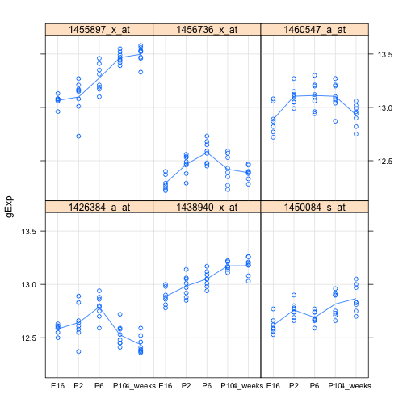
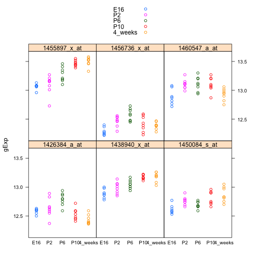
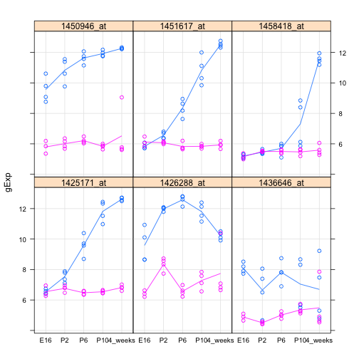
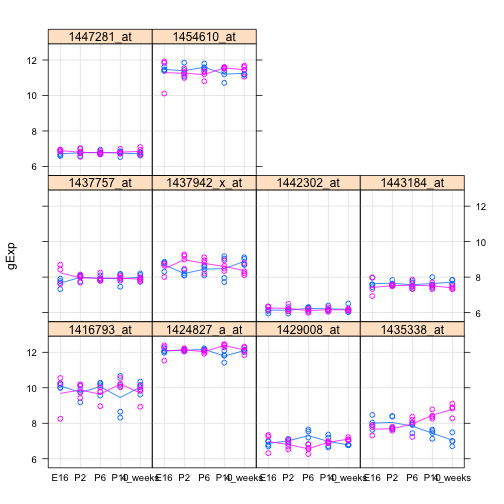

`photoRec` data: differential expression analysis by developmental stage
========================================================


Walks through differential expression analysis with developmental stage as the covariate. Enacts for all probesets at once via `lm()`, exploiting R's built-in ability to fit multiple linear models at once, and via the `lmFit()` function from `limma`. Uses homegrown code to provide missing functionality for extracting info from fitted multivariate regression objects. Does *ad hoc* comparisons of *en masse* results with hand-crafted analysis of individual probesets. Compares output from `lm()` and `limma`. Demonstrates I know how to get whatever I want from the output returned by `lmFit()`.


### Load the data and the design


```r
prDes <- readRDS("../data/GSE4051_design.rds")
prDat <- read.table("../data/GSE4051_data.tsv")
str(prDes)
```

```
## 'data.frame':	39 obs. of  4 variables:
##  $ sidChar : chr  "Sample_20" "Sample_21" "Sample_22" "Sample_23" ...
##  $ sidNum  : num  20 21 22 23 16 17 6 24 25 26 ...
##  $ devStage: Factor w/ 5 levels "E16","P2","P6",..: 1 1 1 1 1 1 1 2 2 2 ...
##  $ gType   : Factor w/ 2 levels "wt","NrlKO": 1 1 1 1 2 2 2 1 1 1 ...
```

```r
with(prDes, table(devStage, gType))
```

```
##          gType
## devStage  wt NrlKO
##   E16      4     3
##   P2       4     4
##   P6       4     4
##   P10      4     4
##   4_weeks  4     4
```

```r
str(prDat, max.level = 0)
```

```
## 'data.frame':	29949 obs. of  39 variables:
```

```r
head(subset(prDat, select = 1:5))
```

```
##              Sample_20 Sample_21 Sample_22 Sample_23 Sample_16
## 1415670_at       7.236     7.414     7.169     7.070     7.383
## 1415671_at       9.478    10.020     9.854    10.130     7.637
## 1415672_at      10.010    10.040     9.913     9.907     8.423
## 1415673_at       8.362     8.374     8.404     8.487     8.363
## 1415674_a_at     8.585     8.615     8.520     8.641     8.509
## 1415675_at       9.591     9.719     9.709     9.700     9.656
```


### `limma`, probeset-specific fits

`limma` requires the user to construct the model matrix, i.e. to "dummy out" the categorical covariate. Then the `lmFit()` function fits a linear model (one-way ANOVA) in this case for each gene, where the response is gene expression and the covariate is developmental stage.


```r
(dmDevStage <- model.matrix(~ devStage, prDes))
```

```
##    (Intercept) devStageP2 devStageP6 devStageP10 devStage4_weeks
## 12           1          0          0           0               0
## 13           1          0          0           0               0
## 14           1          0          0           0               0
## 15           1          0          0           0               0
## 9            1          0          0           0               0
## 10           1          0          0           0               0
## 11           1          0          0           0               0
## 28           1          1          0           0               0
## 29           1          1          0           0               0
## 30           1          1          0           0               0
## 31           1          1          0           0               0
## 24           1          1          0           0               0
## 25           1          1          0           0               0
## 26           1          1          0           0               0
## 27           1          1          0           0               0
## 36           1          0          1           0               0
## 37           1          0          1           0               0
## 38           1          0          1           0               0
## 39           1          0          1           0               0
## 32           1          0          1           0               0
## 33           1          0          1           0               0
## 34           1          0          1           0               0
## 35           1          0          1           0               0
## 20           1          0          0           1               0
## 21           1          0          0           1               0
## 22           1          0          0           1               0
## 23           1          0          0           1               0
## 16           1          0          0           1               0
## 17           1          0          0           1               0
## 18           1          0          0           1               0
## 19           1          0          0           1               0
## 5            1          0          0           0               1
## 6            1          0          0           0               1
## 7            1          0          0           0               1
## 8            1          0          0           0               1
## 1            1          0          0           0               1
## 2            1          0          0           0               1
## 3            1          0          0           0               1
## 4            1          0          0           0               1
## attr(,"assign")
## [1] 0 1 1 1 1
## attr(,"contrasts")
## attr(,"contrasts")$devStage
## [1] "contr.treatment"
```

```r
colnames(dmDevStage) <- levels(prDes$devStage)
fitDevStage <- lmFit(prDat, dmDevStage)
```


The `coef` component of the `lmFit()` output gives the estimated coefficients. One row per probeset, one column per level of `devStage`. Column 1 is the intercept, associated with `devStage = E16`. Columns 2 through 5 are the effects of subsequent timepoints or developmental stages.


```r
head(fitDevStage$coef)
```

```
##                E16      P2       P6      P10  4_weeks
## 1415670_at   7.264 -0.1230  0.02698 -0.08889 -0.01502
## 1415671_at   9.551 -0.3376 -0.03789 -0.33514 -0.14964
## 1415672_at   9.815 -0.2592  0.01079 -0.08896 -0.19959
## 1415673_at   8.457 -0.0872 -0.12457 -0.04907  0.07055
## 1415674_a_at 8.615 -0.1685 -0.08688 -0.19438 -0.23325
## 1415675_at   9.666  0.1275  0.06477 -0.02123 -0.12861
```

```r
str(fitDevStage$coef)
```

```
##  num [1:29949, 1:5] 7.26 9.55 9.81 8.46 8.62 ...
##  - attr(*, "dimnames")=List of 2
##   ..$ : chr [1:29949] "1415670_at" "1415671_at" "1415672_at" "1415673_at" ...
##   ..$ : chr [1:5] "E16" "P2" "P6" "P10" ...
```


The covariance of the estimated coefficients is $\sigma^{2} (X^{T}X)^{-1}$. Since the design matrix $X$ is the same for all probesets, that part of the covariance is global. Let's verify that we understand what the `stdev.unscaled` component of the `lmFit()` output is.


```r
head(fitDevStage$stdev.unscaled)
```

```
##                E16     P2     P6    P10 4_weeks
## 1415670_at   0.378 0.5175 0.5175 0.5175  0.5175
## 1415671_at   0.378 0.5175 0.5175 0.5175  0.5175
## 1415672_at   0.378 0.5175 0.5175 0.5175  0.5175
## 1415673_at   0.378 0.5175 0.5175 0.5175  0.5175
## 1415674_a_at 0.378 0.5175 0.5175 0.5175  0.5175
## 1415675_at   0.378 0.5175 0.5175 0.5175  0.5175
```

```r
sqrt(diag(solve(t(dmDevStage) %*% dmDevStage)))
```

```
##     E16      P2      P6     P10 4_weeks 
##  0.3780  0.5175  0.5175  0.5175  0.5175
```


Gene-specific estimates of residual standard deviation are given in `sigma`.


```r
head(fitDevStage$sigma)
```

```
##   1415670_at   1415671_at   1415672_at   1415673_at 1415674_a_at 
##       0.1506       0.6026       0.3979       0.1683       0.1085 
##   1415675_at 
##       0.1484
```


Again, since the design matrix is the same for all probesets, the residual degrees of freedom are also the same. Specifically they are $n$ minus the number of parameters in the model.

```r
head(fitDevStage$df.residual)
```

```
## [1] 34 34 34 34 34 34
```


At the top of page 62 in 2013 Jan 04 limma User's Guide, it says "The ordinary t-statistics can be recovered by ...". Let's do that.


```r
head(fitDevStage$coef/fitDevStage$stdev.unscaled/fitDevStage$sigma)
```

```
##                 E16     P2       P6     P10 4_weeks
## 1415670_at   127.65 -1.579  0.34625 -1.1407 -0.1927
## 1415671_at    41.94 -1.083 -0.12150 -1.0746 -0.4798
## 1415672_at    65.26 -1.259  0.05237 -0.4320 -0.9691
## 1415673_at   132.94 -1.001 -1.43019 -0.5634  0.8100
## 1415674_a_at 210.16 -3.002 -1.54767 -3.4628 -4.1553
## 1415675_at   172.36  1.661  0.84342 -0.2765 -1.6747
```


### Spot check a `limma` fit with a hand-crafted one

Let's focus on the data for the first probeset.

```r
## work with the first probeset
jDat <- data.frame(devStage = prDes$devStage,
                   gExp = unlist(prDat[1, ]))
lmRes <- lm(gExp ~ devStage, jDat)
```


Verify the coefficient estimates are empirical means and differences between such means and that they match those produced by `lmFit()` in `limma`.

```r
(foo <- with(jDat, tapply(gExp, devStage, mean)))
```

```
##     E16      P2      P6     P10 4_weeks 
##   7.264   7.141   7.291   7.175   7.249
```

```r
foo[-1] <- foo[-1] - foo[1]
data.frame(simpleAvgs = foo, handcraft = coef(lmRes),
           limma = fitDevStage$coef[1, ])
```

```
##         simpleAvgs handcraft    limma
## E16        7.26414   7.26414  7.26414
## P2        -0.12302  -0.12302 -0.12302
## P6         0.02698   0.02698  0.02698
## P10       -0.08889  -0.08889 -0.08889
## 4_weeks   -0.01502  -0.01502 -0.01502
```


Let's check that the estimated standard errors and t statistics agree.

```r
data.frame(handcraft = summary(lmRes)$coef[ , "Std. Error"],
           limma = fitDevStage$sigma[1] * fitDevStage$stdev.unscaled[1, ])
```

```
##                 handcraft   limma
## (Intercept)       0.05691 0.05691
## devStageP2        0.07793 0.07793
## devStageP6        0.07793 0.07793
## devStageP10       0.07793 0.07793
## devStage4_weeks   0.07793 0.07793
```

```r
limma_t_stat <- (fitDevStage$coef/fitDevStage$stdev.unscaled/
                   fitDevStage$sigma)[1, ]
data.frame(handcraft = summary(lmRes)$coef[ , "t value"],
           limma = limma_t_stat)
```

```
##                 handcraft    limma
## (Intercept)      127.6451 127.6451
## devStageP2        -1.5787  -1.5787
## devStageP6         0.3463   0.3463
## devStageP10       -1.1407  -1.1407
## devStage4_weeks   -0.1927  -0.1927
```


### Use built-in `lm()` to fit the probeset-specific models

The build-in function `lm()` can actually do multivariate regression and, with in-house code from Rick White, we can extract the information we need from these fitted models. Strangely, base R does not include many of the standard functions one needs to extract output from a fitted model for `mlm` objects, as opposed to `lm` objects.

The responses must be in a matrix, not a data.frame, with one column per response.

```r
prMat <- t(as.matrix(prDat))
devStage <- prDes$devStage        # lesser of two evils
rFit <- lm(prMat ~ devStage)
```


Here's where we use our homegrown code to provide missing functionality, such as a `summary` method for objects of class `mlm`. __WARNING__: The call to `summary()` will hang if you have not loaded the file sourced below.


```r
source("80_anova-mlm.r")
rfSumm <- summary(rFit)
rfSumm # shows info on first 2 fits, by default
```

```
## Call:
##  lm(formula = prMat ~ devStage)
## 
## ----------------------------
## Response[1]: 1415670_at 
## 
## Residuals:
##      Min       Q1   Median       Q3      Max 
## -0.36325 -0.07963 -0.00913  0.07287  0.36987 
## 
## Coefficients:
##                 Estimate Std. Error t value Pr(>|t|)    
## (Intercept)       7.2641     0.0569  127.65   <2e-16 ***
## devStageP2       -0.1230     0.0779   -1.58     0.12    
## devStageP6        0.0270     0.0779    0.35     0.73    
## devStageP10      -0.0889     0.0779   -1.14     0.26    
## devStage4_weeks  -0.0150     0.0779   -0.19     0.85    
## ---
## Signif. codes:  0 '***' 0.001 '**' 0.01 '*' 0.05 '.' 0.1 ' ' 1
## 
## Residual standard error: 0.151 on 34 degrees of freedom
## Multiple R-Squared: 0.141,	Adjusted R-squared: 0.0397
## F-statistic: 1.39 on 4 and 34 DF,  p-value: 0.257
## ----------------------------
## Response[2]: 1415671_at 
## 
## Residuals:
##    Min     Q1 Median     Q3    Max 
## -1.914 -0.243  0.158  0.356  0.777 
## 
## Coefficients:
##                 Estimate Std. Error t value Pr(>|t|)    
## (Intercept)       9.5511     0.2278   41.94   <2e-16 ***
## devStageP2       -0.3376     0.3119   -1.08     0.29    
## devStageP6       -0.0379     0.3119   -0.12     0.90    
## devStageP10      -0.3351     0.3119   -1.07     0.29    
## devStage4_weeks  -0.1496     0.3119   -0.48     0.63    
## ---
## Signif. codes:  0 '***' 0.001 '**' 0.01 '*' 0.05 '.' 0.1 ' ' 1
## 
## Residual standard error: 0.603 on 34 degrees of freedom
## Multiple R-Squared: 0.0599,	Adjusted R-squared: -0.0507
## F-statistic: 0.542 on 4 and 34 DF,  p-value: 0.706
## ----------------------------
## 29947 models not displayed
```

```r
print(rfSumm, show = c(2, 4555, 29403)) # show gives more flexibility
```

```
## Call:
##  lm(formula = prMat ~ devStage)
## 
## ----------------------------
## Response[2]: 1415671_at 
## 
## Residuals:
##    Min     Q1 Median     Q3    Max 
## -1.914 -0.243  0.158  0.356  0.777 
## 
## Coefficients:
##                 Estimate Std. Error t value Pr(>|t|)    
## (Intercept)       9.5511     0.2278   41.94   <2e-16 ***
## devStageP2       -0.3376     0.3119   -1.08     0.29    
## devStageP6       -0.0379     0.3119   -0.12     0.90    
## devStageP10      -0.3351     0.3119   -1.07     0.29    
## devStage4_weeks  -0.1496     0.3119   -0.48     0.63    
## ---
## Signif. codes:  0 '***' 0.001 '**' 0.01 '*' 0.05 '.' 0.1 ' ' 1
## 
## Residual standard error: 0.603 on 34 degrees of freedom
## Multiple R-Squared: 0.0599,	Adjusted R-squared: -0.0507
## F-statistic: 0.542 on 4 and 34 DF,  p-value: 0.706
## ----------------------------
## Response[4555]: 1422146_at 
## 
## Residuals:
##     Min      Q1  Median      Q3     Max 
## -0.3691 -0.1216  0.0170  0.0651  0.5449 
## 
## Coefficients:
##                 Estimate Std. Error t value Pr(>|t|)    
## (Intercept)       6.1041     0.0712   85.74   <2e-16 ***
## devStageP2        0.3427     0.0975    3.52   0.0013 ** 
## devStageP6        0.2367     0.0975    2.43   0.0206 *  
## devStageP10       0.1499     0.0975    1.54   0.1335    
## devStage4_weeks   0.0342     0.0975    0.35   0.7276    
## ---
## Signif. codes:  0 '***' 0.001 '**' 0.01 '*' 0.05 '.' 0.1 ' ' 1
## 
## Residual standard error: 0.188 on 34 degrees of freedom
## Multiple R-Squared: 0.34,	Adjusted R-squared: 0.262
## F-statistic: 4.37 on 4 and 34 DF,  p-value: 0.00585
## ----------------------------
## Response[29403]: 1459967_at 
## 
## Residuals:
##       Min        Q1    Median        Q3       Max 
## -0.376286 -0.109955  0.000714  0.087375  0.464714 
## 
## Coefficients:
##                 Estimate Std. Error t value Pr(>|t|)    
## (Intercept)       6.5813     0.0647  101.78   <2e-16 ***
## devStageP2        0.2483     0.0885    2.80   0.0083 ** 
## devStageP6        0.1932     0.0885    2.18   0.0361 *  
## devStageP10       0.1191     0.0885    1.35   0.1875    
## devStage4_weeks  -0.0160     0.0885   -0.18   0.8574    
## ---
## Signif. codes:  0 '***' 0.001 '**' 0.01 '*' 0.05 '.' 0.1 ' ' 1
## 
## Residual standard error: 0.171 on 34 degrees of freedom
## Multiple R-Squared: 0.297,	Adjusted R-squared: 0.215
## F-statistic: 3.59 on 4 and 34 DF,  p-value: 0.0151
## ----------------------------
## 29946 models not displayed
```


This summary object is a list, with components for estimated coefficients, various overall statistics, and the residuals.


```r
str(rfSumm, max.level = 1)
```

```
## List of 3
##  $ Coefficients  : num [1:29949, 1:5, 1:4] 7.26 9.55 9.81 8.46 8.62 ...
##   ..- attr(*, "dimnames")=List of 3
##  $ FullModelStats: num [1:29949, 1:5] 0.151 0.603 0.398 0.168 0.108 ...
##   ..- attr(*, "dimnames")=List of 2
##  $ Residuals     : num [1:29949, 1:39] -0.0281 -0.0731 0.1953 -0.0946 -0.03 ...
##   ..- attr(*, "dimnames")=List of 2
##  - attr(*, "DF")= int [1:2] 4 34
##  - attr(*, "class")= chr "summary.mlm"
##  - attr(*, "call")= language lm(formula = prMat ~ devStage)
```

```r
str(rfSumm$Coef)
```

```
##  num [1:29949, 1:5, 1:4] 7.26 9.55 9.81 8.46 8.62 ...
##  - attr(*, "dimnames")=List of 3
##   ..$ : chr [1:29949] "1415670_at" "1415671_at" "1415672_at" "1415673_at" ...
##   ..$ : chr [1:5] "(Intercept)" "devStageP2" "devStageP6" "devStageP10" ...
##   ..$ : chr [1:4] "Estimate" "Std. Error" "t value" "Pr(>|t|)"
```


The `Coefficients` component is a 3-dimensional array with one row per probeset and one column per parameter. The third dimension is 4, accomodating the estimate, standard error, t statistic and p-value for the parameters estimated for each probeset.


```r
str(rfSumm$FullModelStats)
```

```
##  num [1:29949, 1:5] 0.151 0.603 0.398 0.168 0.108 ...
##  - attr(*, "dimnames")=List of 2
##   ..$ : chr [1:29949] "1415670_at" "1415671_at" "1415672_at" "1415673_at" ...
##   ..$ : chr [1:5] "Res. SE" "Fstat" "Pval" "R-Squared" ...
```

```r
head(rfSumm$FullModelStats)
```

```
##              Res. SE  Fstat     Pval R-Squared Adj R-Sqr
## 1415670_at    0.1506 1.3928 0.257221   0.14079   0.03971
## 1415671_at    0.6026 0.5416 0.706242   0.05990  -0.05070
## 1415672_at    0.3979 0.7062 0.593288   0.07671  -0.03192
## 1415673_at    0.1683 1.6297 0.189350   0.16088   0.06216
## 1415674_a_at  0.1085 5.5149 0.001563   0.39350   0.32215
## 1415675_at    0.1484 3.3682 0.019991   0.28380   0.19954
```


The `FullModelStats` component is an $n$ by 5 matrix, one row per probeset, columns providing various statistics related to the whole model (vs. individual parameters).

### Check that built-in `lm()` and `lmFit()` from `limma` give same results

The estimated coefficients are stored in a transposed fashion by `lm()`, relative to `lmFit()`. There are differences in the naming convention as well. But after finessing these minor issues, we can test for equality of estimated coefficients.

```r
str(estCoef_lm <- t(coef(rFit)))
```

```
##  num [1:29949, 1:5] 7.26 9.55 9.81 8.46 8.62 ...
##  - attr(*, "dimnames")=List of 2
##   ..$ : chr [1:29949] "1415670_at" "1415671_at" "1415672_at" "1415673_at" ...
##   ..$ : chr [1:5] "(Intercept)" "devStageP2" "devStageP6" "devStageP10" ...
```

```r
colnames(estCoef_lm) <- levels(prDes$devStage)
str(coef(fitDevStage))
```

```
##  num [1:29949, 1:5] 7.26 9.55 9.81 8.46 8.62 ...
##  - attr(*, "dimnames")=List of 2
##   ..$ : chr [1:29949] "1415670_at" "1415671_at" "1415672_at" "1415673_at" ...
##   ..$ : chr [1:5] "E16" "P2" "P6" "P10" ...
```

```r
all.equal(estCoef_lm, coef(fitDevStage))
```

```
## [1] TRUE
```


We can similarly check for agreement with respect to estimated standard errors.

```r
str(estSe_lm <- rfSumm$Coef[ , , "Std. Error"])
```

```
##  num [1:29949, 1:5] 0.0569 0.2278 0.1504 0.0636 0.041 ...
##  - attr(*, "dimnames")=List of 2
##   ..$ : chr [1:29949] "1415670_at" "1415671_at" "1415672_at" "1415673_at" ...
##   ..$ : chr [1:5] "(Intercept)" "devStageP2" "devStageP6" "devStageP10" ...
```

```r
colnames(estSe_lm) <- levels(prDes$devStage)
str(fitDevStage$sigma * fitDevStage$stdev.unscaled)
```

```
##  num [1:29949, 1:5] 0.0569 0.2278 0.1504 0.0636 0.041 ...
##  - attr(*, "dimnames")=List of 2
##   ..$ : chr [1:29949] "1415670_at" "1415671_at" "1415672_at" "1415673_at" ...
##   ..$ : chr [1:5] "E16" "P2" "P6" "P10" ...
```

```r
all.equal(estSe_lm, fitDevStage$sigma * fitDevStage$stdev.unscaled)
```

```
## [1] TRUE
```


Check for agreement with respect to t statistics.

```r
str(tStat_lm <- rfSumm$Coef[ , , "t value"])
```

```
##  num [1:29949, 1:5] 127.6 41.9 65.3 132.9 210.2 ...
##  - attr(*, "dimnames")=List of 2
##   ..$ : chr [1:29949] "1415670_at" "1415671_at" "1415672_at" "1415673_at" ...
##   ..$ : chr [1:5] "(Intercept)" "devStageP2" "devStageP6" "devStageP10" ...
```

```r
colnames(tStat_lm) <- levels(prDes$devStage)
str(tStat_lmFit <- coef(fitDevStage) /
      (fitDevStage$sigma * fitDevStage$stdev.unscaled))
```

```
##  num [1:29949, 1:5] 127.6 41.9 65.3 132.9 210.2 ...
##  - attr(*, "dimnames")=List of 2
##   ..$ : chr [1:29949] "1415670_at" "1415671_at" "1415672_at" "1415673_at" ...
##   ..$ : chr [1:5] "E16" "P2" "P6" "P10" ...
```

```r
all.equal(tStat_lm, tStat_lmFit)
```

```
## [1] TRUE
```


Check for agreement with respect to estimated residual variance.

```r
str(ssq_lm <- deviance(rFit) / df.residual(rFit))
```

```
##  Named num [1:29949] 0.0227 0.3631 0.1583 0.0283 0.0118 ...
##  - attr(*, "names")= chr [1:29949] "1415670_at" "1415671_at" "1415672_at" "1415673_at" ...
```

```r
str(ssq_lmRick <- rfSumm$Full[ , "Res. SE"] ^ 2)
```

```
##  Named num [1:29949] 0.0227 0.3631 0.1583 0.0283 0.0118 ...
##  - attr(*, "names")= chr [1:29949] "1415670_at" "1415671_at" "1415672_at" "1415673_at" ...
```

```r
str(ssq_lmFit <- fitDevStage$sigma ^ 2)
```

```
##  Named num [1:29949] 0.0227 0.3631 0.1583 0.0283 0.0118 ...
##  - attr(*, "names")= chr [1:29949] "1415670_at" "1415671_at" "1415672_at" "1415673_at" ...
```

```r
all.equal(ssq_lm, ssq_lmFit)
```

```
## [1] TRUE
```

```r
all.equal(ssq_lm, ssq_lmRick)
```

```
## [1] TRUE
```


### Progressing to the Empirical Bayes phase of `limma` analysis

This is where we use Empirical Bayes methods to borrow strength across the probsets with respect to estimating gene expression variability.

First note that various quantities are undefined or `NULL` when working with the "plain vanilla" linear model results from `lmFit()`.


```r
head(fitDevStage$F)
```

```
## NULL
```

```r
fitDevStage$s2.prior
```

```
## NULL
```

```r
fitDevStage$df.prior
```

```
## NULL
```

```r
head(fitDevStage$var.prior)
```

```
## NULL
```

```r
head(fitDevStage$t)
```

```
## NULL
```


Here's where the magic happens


```r
ebFitDevStage <- eBayes(fitDevStage)
```


Note that the estimated coefficients have NOT changed.


```r
head(cbind(coef(ebFitDevStage), coef(fitDevStage)))
```

```
##                E16      P2       P6      P10  4_weeks   E16      P2
## 1415670_at   7.264 -0.1230  0.02698 -0.08889 -0.01502 7.264 -0.1230
## 1415671_at   9.551 -0.3376 -0.03789 -0.33514 -0.14964 9.551 -0.3376
## 1415672_at   9.815 -0.2592  0.01079 -0.08896 -0.19959 9.815 -0.2592
## 1415673_at   8.457 -0.0872 -0.12457 -0.04907  0.07055 8.457 -0.0872
## 1415674_a_at 8.615 -0.1685 -0.08688 -0.19438 -0.23325 8.615 -0.1685
## 1415675_at   9.666  0.1275  0.06477 -0.02123 -0.12861 9.666  0.1275
##                    P6      P10  4_weeks
## 1415670_at    0.02698 -0.08889 -0.01502
## 1415671_at   -0.03789 -0.33514 -0.14964
## 1415672_at    0.01079 -0.08896 -0.19959
## 1415673_at   -0.12457 -0.04907  0.07055
## 1415674_a_at -0.08688 -0.19438 -0.23325
## 1415675_at    0.06477 -0.02123 -0.12861
```

```r
all.equal(coef(ebFitDevStage), coef(fitDevStage))
```

```
## [1] TRUE
```


Here are the mean of the inverse Chisquare prior for the gene-specific variances and the associated degrees of freedom.


```r
ebFitDevStage$s2.prior
```

```
## [1] 0.06625
```

```r
ebFitDevStage$df.prior
```

```
## [1] 2.881
```


A few comparisons of plain vanilla `lm()` results, obtained through various methods, and `limma` results after the Empirical Bayes step.


```r
## estimated residual variance
head(cbind(rFit1 = deviance(rFit)/df.residual(rFit),
           rFit2 = rfSumm$Full[ , "Res. SE"] ^ 2,
           limma = fitDevStage$sigma ^ 2,
           ebLimma = ebFitDevStage$s2.post))
```

```
##                rFit1   rFit2   limma ebLimma
## 1415670_at   0.02267 0.02267 0.02267 0.02607
## 1415671_at   0.36311 0.36311 0.36311 0.33992
## 1415672_at   0.15835 0.15835 0.15835 0.15115
## 1415673_at   0.02832 0.02832 0.02832 0.03129
## 1415674_a_at 0.01176 0.01176 0.01176 0.01602
## 1415675_at   0.02202 0.02202 0.02202 0.02547
```

```r

## t statistics for P2
head(cbind(rFit = rfSumm$Coef[ , "devStageP2", "t value"],
           limma = coef(fitDevStage)[ , "P2"] /
             (fitDevStage$sigma * fitDevStage$stdev.unscaled[ , "P2"]),
           ebLimma = ebFitDevStage$t[ , "P2"]))
```

```
##                rFit  limma ebLimma
## 1415670_at   -1.579 -1.579 -1.4720
## 1415671_at   -1.083 -1.083 -1.1190
## 1415672_at   -1.259 -1.259 -1.2882
## 1415673_at   -1.001 -1.001 -0.9525
## 1415674_a_at -3.002 -3.002 -2.5723
## 1415675_at    1.661  1.661  1.5438
```

```r

## pvalues for P10
head(cbind(rFit = rfSumm$Coef[ , "devStageP10", "Pr(>|t|)"],
           ebLimma = ebFitDevStage$p.value[ , "P10"]))
```

```
##                  rFit  ebLimma
## 1415670_at   0.261951 0.294394
## 1415671_at   0.290110 0.273895
## 1415672_at   0.668489 0.660974
## 1415673_at   0.576872 0.595146
## 1415674_a_at 0.001463 0.005249
## 1415675_at   0.783847 0.798568
```


### Inspecting a few hits

`topTable()` is a useful `limma` function for sorting the genes/probesets based on the fits. By default, it returns the top 10 with respect to the B-statistic (the log-odds of DE, I believe).


```r
(hits <- topTable(ebFitDevStage))
```

```
##                E16       P2        P6      P10 X4_weeks AveExpr      F
## 1438940_x_at 12.89  0.09786  0.164107  0.28661  0.28786   13.06 123924
## 1450084_s_at 12.62  0.14429  0.074286  0.20054  0.25179   12.75  95108
## 1455897_x_at 13.07  0.03179  0.209286  0.40054  0.43179   13.29  87636
## 1456736_x_at 12.29  0.17500  0.287500  0.13000  0.09750   12.43  87353
## 1426384_a_at 12.58  0.05839  0.205893 -0.05661 -0.14786   12.60  77149
## 1460547_a_at 12.89  0.21786  0.224107  0.21661  0.04286   13.03  75635
## 1437192_x_at 12.98  0.18179  0.186786  0.19054  0.01554   13.09  75275
## 1456349_x_at 11.64  0.10643 -0.007321 -0.10357 -0.33357   11.57  73041
## 1438839_a_at 13.42 -0.03214  0.071607 -0.18464 -0.19839   13.35  72186
## 1436884_x_at 12.95  0.06089  0.138393 -0.01661  0.02464   13.00  71046
##                P.Value adj.P.Val
## 1438940_x_at 7.934e-77 2.376e-72
## 1450084_s_at 1.044e-74 1.564e-70
## 1455897_x_at 4.721e-74 3.752e-70
## 1456736_x_at 5.011e-74 3.752e-70
## 1426384_a_at 4.951e-73 2.965e-69
## 1460547_a_at 7.136e-73 3.334e-69
## 1437192_x_at 7.792e-73 3.334e-69
## 1456349_x_at 1.358e-72 5.083e-69
## 1438839_a_at 1.687e-72 5.615e-69
## 1436884_x_at 2.263e-72 6.777e-69
```

```r
(getMe <- rownames(hits)[1:6])
```

```
## [1] "1438940_x_at" "1450084_s_at" "1455897_x_at" "1456736_x_at"
## [5] "1426384_a_at" "1460547_a_at"
```

```r
jDat <- t(prDat[getMe, ])
jDat <- data.frame(gExp = as.vector(jDat),
                   probeset = rep(colnames(jDat),
                   each = nrow(jDat)))
kDat <- data.frame(prDes, jDat)
```

```
## Warning: row names were found from a short variable and have been
## discarded
```

```r
str(kDat)
```

```
## 'data.frame':	234 obs. of  6 variables:
##  $ sidChar : chr  "Sample_20" "Sample_21" "Sample_22" "Sample_23" ...
##  $ sidNum  : num  20 21 22 23 16 17 6 24 25 26 ...
##  $ devStage: Factor w/ 5 levels "E16","P2","P6",..: 1 1 1 1 1 1 1 2 2 2 ...
##  $ gType   : Factor w/ 2 levels "wt","NrlKO": 1 1 1 1 2 2 2 1 1 1 ...
##  $ gExp    : num  13 12.8 12.9 12.8 13 ...
##  $ probeset: Factor w/ 6 levels "1426384_a_at",..: 2 2 2 2 2 2 2 2 2 2 ...
```

```r

stripplot(gExp ~ devStage | probeset, kDat,
          type = c('p', 'a'), grid = TRUE)
```

 

```r

stripplot(gExp ~ devStage | probeset, kDat,
          groups = devStage, auto.key = TRUE)
```

 


### Inspecting a few non-hits

Looking for non-hits, to use as examples in, e.g., lecture.


```r
n <- nrow(prDat)
nonhits <- topTable(ebFitDevStage, n = Inf)[(n - 5):n, ]
(getMe <- rownames(nonhits)[1:6])
```

```
## [1] "1458418_at" "1426288_at" "1425171_at" "1436646_at" "1451617_at"
## [6] "1450946_at"
```

```r
jDat <- t(prDat[getMe, ])
jDat <- data.frame(gExp = as.vector(jDat),
                   probeset = rep(colnames(jDat),
                                  each = nrow(jDat)))
kDat <- data.frame(prDes, jDat)
```

```
## Warning: row names were found from a short variable and have been
## discarded
```

```r
str(kDat)
```

```
## 'data.frame':	234 obs. of  6 variables:
##  $ sidChar : chr  "Sample_20" "Sample_21" "Sample_22" "Sample_23" ...
##  $ sidNum  : num  20 21 22 23 16 17 6 24 25 26 ...
##  $ devStage: Factor w/ 5 levels "E16","P2","P6",..: 1 1 1 1 1 1 1 2 2 2 ...
##  $ gType   : Factor w/ 2 levels "wt","NrlKO": 1 1 1 1 2 2 2 1 1 1 ...
##  $ gExp    : num  5.32 5.05 5.13 5.3 5.38 ...
##  $ probeset: Factor w/ 6 levels "1425171_at","1426288_at",..: 6 6 6 6 6 6 6 6 6 6 ...
```

```r
stripplot(gExp ~ devStage | probeset, kDat,
          type = c('p', 'a'), grid = TRUE,
          group = gType)
```

 


Although I found these probesets by looking for non-hits, what I seem to have gotten is just probesets for which there is an interaction between developmental stage and genotype. This is pathological behavior which comes from ignoring an important predictor, namely, genotype. I am paying for oversimplifying.

I will try again, using the overall F test as a screening tool. This is a wee bit more successful.


```r
(getMe <- which(rank( (rfSumm$FullModelStats)[ , "Fstat"]) <= 10))
```

```
##   1416793_at 1424827_a_at   1429008_at   1435338_at   1437757_at 
##          966         6548         9617        13797        15601 
## 1437942_x_at   1442302_at   1443184_at   1447281_at   1454610_at 
##        15720        18435        18898        21057        25964
```

```r
jDat <- t(prDat[getMe, ])
jDat <- data.frame(gExp = as.vector(jDat),
                   probeset = rep(colnames(jDat),
                                  each = nrow(jDat)))
kDat <- data.frame(prDes, jDat)
```

```
## Warning: row names were found from a short variable and have been
## discarded
```

```r
str(kDat)
```

```
## 'data.frame':	390 obs. of  6 variables:
##  $ sidChar : chr  "Sample_20" "Sample_21" "Sample_22" "Sample_23" ...
##  $ sidNum  : num  20 21 22 23 16 17 6 24 25 26 ...
##  $ devStage: Factor w/ 5 levels "E16","P2","P6",..: 1 1 1 1 1 1 1 2 2 2 ...
##  $ gType   : Factor w/ 2 levels "wt","NrlKO": 1 1 1 1 2 2 2 1 1 1 ...
##  $ gExp    : num  10.25 10.16 10.01 10 8.25 ...
##  $ probeset: Factor w/ 10 levels "1416793_at","1424827_a_at",..: 1 1 1 1 1 1 1 1 1 1 ...
```

```r
stripplot(gExp ~ devStage | probeset, kDat,
          type = c('p', 'a'), grid = TRUE, group = gType)
```

 

```r
## 1447281_at is super boring, row 21057
## 1443184_at also nice, row 18898
```


